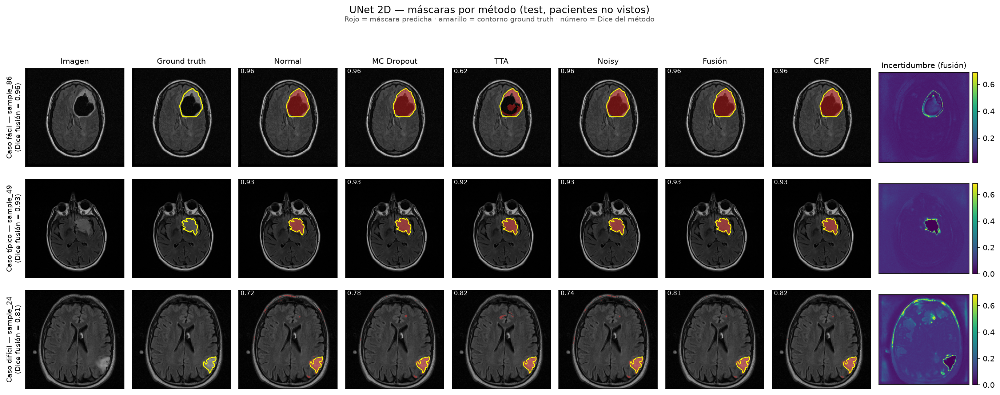
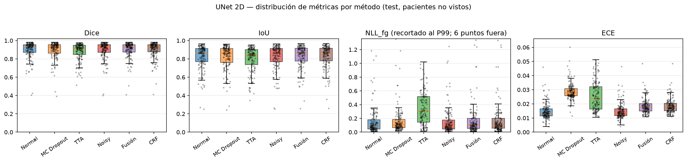
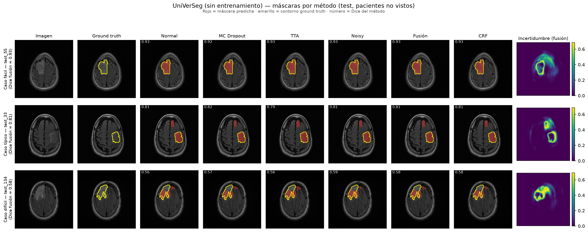
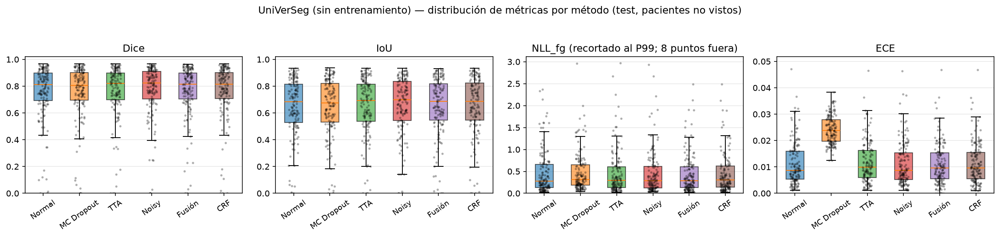
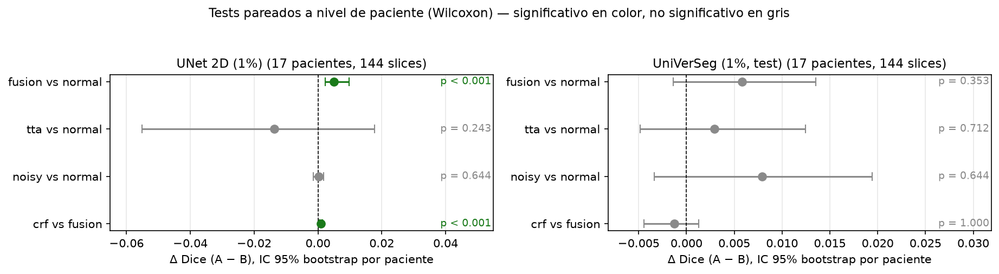
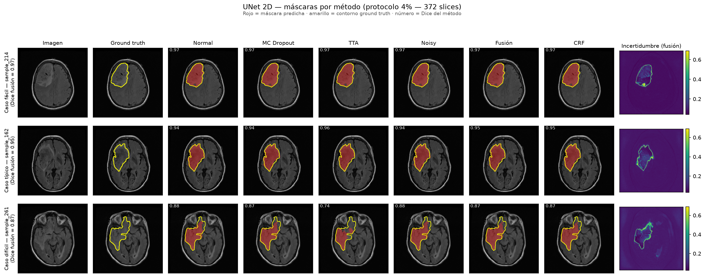
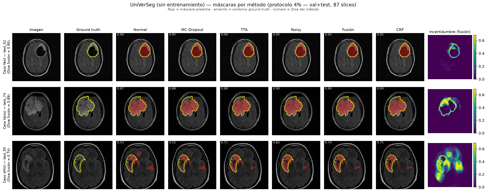
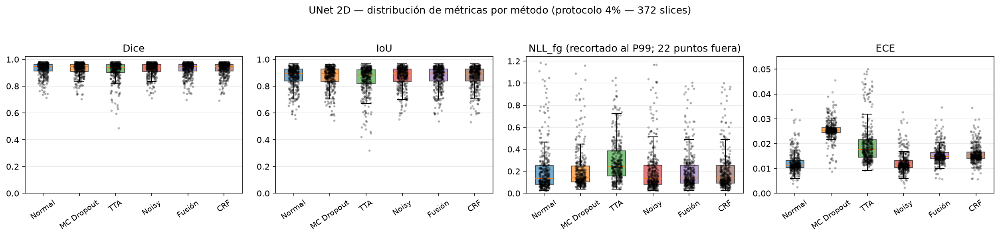
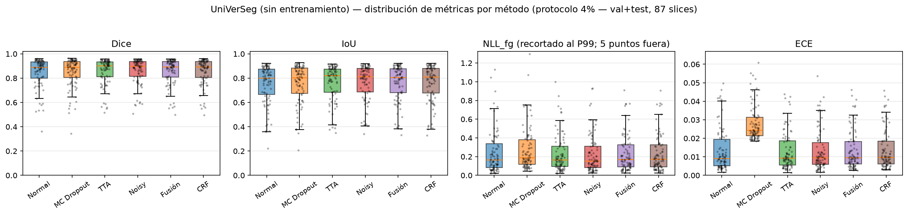
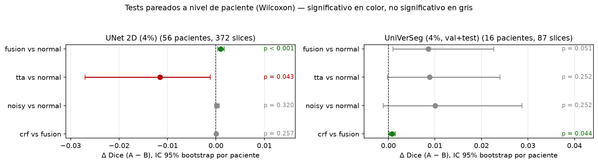

# TFM: Medical Image Segmentation with Uncertainty Estimation

[](https://www.python.org/)
[](https://pytorch.org/)

Master's Thesis comparing **UNet** and **UniVerSeg** with **uncertainty quantification** (MC Dropout, TTA, Noisy Inference, Fusion, CRF) on brain MRI (LGG Segmentation Dataset). **Patient-level split** ensures no data leakage between train/test.

---

## Contents

[Features](#features) · [Dataset](#dataset) · [Quick Start](#quick-start) · [Uncertainty Methods](#uncertainty-methods) · [Results](#results) · [Statistical Analysis](#statistical-analysis) · [4% Protocol](#4-protocol-thesis-reproduction) · [Ablation Studies](#ablation-studies) · [Output Structure](#output-structure) · [Project Structure](#project-structure) · [Tests](#tests) · [Requirements](#requirements) · [Citation](#citation)

## Features

- **UNet 2D** — trained from scratch (60 epochs, augmentation, early stopping)
- **UniVerSeg few-shot** — zero-shot with configurable context size (1–128 images)
- **Uncertainty methods** — MC Dropout, TTA, Noisy, Fusion, CRF
- **Pure numpy/OpenCV CRF** — no compilation needed
- **Patient-level split** — 70/15/15 over 108 patients, 144 imágenes de test

## Dataset

**LGG MRI Segmentation** (Kaggle): 3,929 images from 110 patients. RGB channels = T1/T1c/FLAIR. Filtered at **1% foreground threshold** → **1,060 images from 108 patients** (removes slices with <1% tumor while retaining 77% of tumor images).

```bash
./scripts/download_data.sh lgg
```

## Quick Start

```bash
# Install
python -m venv .venv && source .venv/bin/activate
uv pip install -e .
pip install git+https://github.com/JJGO/UniverSeg.git

# Download + filter dataset
./scripts/download_data.sh lgg

# UNet: train + evaluate
python -m src.utils.train_unet --data-root ./MRI/filtered_data --epochs 60
python -m src.pipelines.run_unet --config configs/pipeline_2d.yaml --checkpoint unet_model.pth

# UniVerSeg: few-shot
python -m src.pipelines.run_foundation --config configs/foundation_universeg.yaml --context-size 64
```

## Uncertainty Methods

| Method | Description | UNet | UniVerSeg |
|--------|-------------|:----:|:---------:|
| **Normal** | Single forward pass | ✓ | ✓ |
| **MC Dropout** | 30 passes with random dropout (p=0.01) on all layers | ✓ | ✓ |
| **TTA** | UNet: flip + scales + intensity (30 combinations) + average. UniVerSeg: 9 photometric transforms (identity, intensity ×, gamma, contrast, bias) | ✓ | ✓† |
| **Noisy** | 30 passes with Gaussian noise (σ=0.01 UNet / 0.1 UniVerSeg) added to input | ✓ | ✓ |
| **Fusion** | Uncertainty-weighted average of MC+TTA+Noisy (inverse weighting) | ✓ | ✓ |
| **CRF** | Dense CRF refinement (numpy/OpenCV, edge-stopped kernels, 3 iterations) | ✓ | ✓ |

> † UniVerSeg TTA uses size- and orientation-preserving photometric transforms only: ttach's Scale breaks on models with internal resizing (deaugmented masks come back as mixed sizes 256/128/64 → stack error), and flips are invalid for in-context models with a fixed support set (they break query-support matching: flip-averaged TTA drops support Dice from 0.94 to 0.14).

> **CRF implementation**: pure numpy/OpenCV (Krähenbühl & Koltun 2012, mean-field) — Gaussian + bilateral kernels in log-space, edge-stopped; falls back to Gaussian-only if OpenCV is unavailable. For pydensecrf (Python ≤3.11): `pip install pydensecrf`.

## Results

### UNet 2D

Split por paciente, 144 imágenes de test (pacientes no vistos), 30 muestras MC/TTA/ruido:

| Evaluación | IoU | Dice |
|:----------|:---:|:----:|
| **Test set completo** (144 img, 1-7% tumor) | 0.820 | 0.894 |
| **Solo >3% tumor** (72 img) | **0.872** | **0.929** |

| Método de incertidumbre | Dice | IoU | NLL | NLL_fg | ECE | Accuracy | Precision | Recall | Certainty |
|------------------------|:----:|:---:|:---:|:------:|:---:|:--------:|:---------:|:------:|:---------:|
| Normal | 0.894 | 0.820 | 0.035 | 0.177 | 0.015 | 0.993 | 0.863 | 0.945 | 0.923 |
| MC Dropout | 0.894 | 0.820 | 0.046 | 0.173 | 0.029 | 0.993 | 0.867 | 0.941 | 0.790 |
| TTA | 0.880 | 0.797 | 0.041 | 0.354 | 0.025 | 0.992 | 0.902 | 0.881 | 0.480 |
| Noisy | 0.894 | 0.820 | 0.035 | 0.171 | 0.015 | 0.993 | 0.863 | 0.945 | 0.894 |
| **Fusión** | **0.899** | **0.826** | 0.035 | 0.171 | 0.019 | 0.993 | 0.873 | 0.942 | 0.859 |
| CRF | 0.900 | 0.827 | 0.035 | 0.171 | 0.019 | 0.993 | 0.875 | 0.941 | 0.833 |

> **Métricas**: `ECE` es la calibración promediada por clase (corregida: la definición anterior quedaba dominada por el fondo y saturaba en ~0.95); `NLL_fg` es la NLL restringida a píxeles de tumor. `Certainty` es la confianza media dentro del tumor de referencia.
>
> **Notas**: La métrica de referencia (Dice 0.894) usa todos los tamaños de tumor (1-7%). Sobre tumores >3% (72 imágenes) el Dice sube a 0.929. Tras corregir la implementación del CRF (pesos ~10× menores, sin mezcla del unario hacia el uniforme, kernel bilateral operativo y parada en bordes de la imagen), el post-proceso ya no degrada el resultado: rinde igual o levemente por encima de la fusión.


*Tres casos de test (fácil / típico / difícil, elegidos por percentiles de Dice): máscara predicha (rojo) sobre la imagen, contorno ground truth (amarillo), Dice de cada método e incertidumbre de la fusión.*


*Distribución por slice (144 slices de test) de Dice, IoU, NLL_fg y ECE para cada método; los puntos son slices individuales.*

### UniVerSeg (G channel T1c, context-size 64)

| Método de incertidumbre | Test Dice | Test IoU | Test ECE | Support Dice | Support IoU |
|------------------------|:---------:|:--------:|:--------:|:------------:|:-----------:|
| **Normal** | 0.758 | 0.646 | 0.011 | 0.939 | 0.887 |
| **MC Dropout** | 0.754 | 0.643 | 0.024 | 0.940 | 0.889 |
| **TTA** | 0.761 | 0.649 | 0.012 | 0.939 | 0.887 |
| **Noisy** | **0.766** | **0.655** | 0.011 | 0.939 | 0.887 |
| **Fusion** | **0.764** | 0.652 | 0.011 | 0.940 | 0.888 |
| **CRF** | 0.763 | 0.652 | 0.011 | 0.939 | 0.887 |

> TTA ahora disponible: 9 transformaciones fotorrométricas (ver tabla de métodos). Canal G (T1c) usado en lugar de RGB completo — ver estudio #3.

> UniVerSeg con canal G (T1c) alcanza el **85% del rendimiento de UNet sin necesidad de entrenamiento** (Dice 0.758 vs 0.894). Sobre las imágenes de soporte (que ya ha visto en contexto), iguala a UNet (Dice 0.939).


*Tres casos de test no vistos (fácil / típico / difícil): máscara predicha (rojo), contorno ground truth (amarillo), Dice por método e incertidumbre de la fusión.*


*Distribución por slice (144 slices de test de pacientes no vistos) de Dice, IoU, NLL_fg y ECE; se aprecia la cola de casos difíciles (Dice≈0) y el mejor calibrado de TTA/Noisy/Fusión frente a MC Dropout.*

---

## Statistical Analysis

Paired comparisons at patient level: slices from the same patient are not independent samples, so confidence intervals use a **cluster bootstrap** (patients resampled with replacement, 10,000 iterations) and significance is tested with the **Wilcoxon signed-rank test on per-patient means** (17 test patients, 144 slices). Regenerate with:

```bash
python -m src.utils.statistics --pipeline all   # → statistical_tests.csv en cada pipeline
```

### UNet 2D

| Comparación | Métrica | Δ medio | IC 95% (bootstrap paciente) | p (Wilcoxon) | Pacientes con mejora |
|---|---|---:|---|---:|---:|
| **Fusión vs Normal** | Dice | **+0.0050** | [+0.0022, +0.0098] | **<0.001** | **100%** |
| **Fusión vs Normal** | IoU | **+0.0067** | [+0.0032, +0.0132] | **<0.001** | **100%** |
| Fusión vs Normal | NLL_fg | -0.0056 | [-0.0264, +0.0111] | 0.431 | 71% |
| **CRF vs Fusión** | Dice | +0.0008 | [+0.0004, +0.0015] | **0.001** | 82% |
| CRF vs Fusión | IoU | +0.0012 | [+0.0005, +0.0021] | 0.001 | 88% |
| TTA vs Normal | Dice | -0.0138 | [-0.0551, +0.0177] | 0.243 | 71% |
| Noisy vs Normal | Dice | +0.0002 | [-0.0015, +0.0018] | 0.644 | 65% |

### UniVerSeg (test, unseen patients)

| Comparación | Métrica | Δ medio | IC 95% (bootstrap paciente) | p (Wilcoxon) | Pacientes con mejora |
|---|---|---:|---|---:|---:|
| Fusión vs Normal | Dice | +0.0058 | [-0.0014, +0.0135] | 0.353 | 65% |
| Fusión vs Normal | IoU | +0.0067 | [-0.0004, +0.0138] | 0.243 | 65% |
| CRF vs Fusión | Dice | -0.0013 | [-0.0045, +0.0013] | 1.000 | 53% |
| TTA vs Normal | Dice | +0.0029 | [-0.0048, +0.0124] | 0.712 | 65% |
| Noisy vs Normal | Dice | +0.0079 | [-0.0034, +0.0194] | 0.644 | 53% |

**Lectura**:
- **UNet**: la fusión mejora al Normal de forma pequeña pero sistemática y significativa (+0.005 Dice, **los 17 pacientes mejoran**, p<0.001); el CRF corregido también añade una mejora significativa sobre la fusión (p=0.001). TTA y Noisy no se distinguen del Normal.
- **UniVerSeg**: fusión y noisy muestran la misma dirección (+0.006 / +0.008 Dice) pero **sin alcanzar significancia con 17 pacientes** (los intervalos incluyen 0); el CRF corregido es estadísticamente indistinguible de la fusión (p=1.0). Confirmar el efecto requeriría un test set mayor o validación cruzada.
- p-valores sin corregir por comparaciones múltiples (análisis exploratorio); `statistical_tests.csv` incluye además `cohen_dz`, % de slices mejoradas y tamaños por comparación.


*ΔDice (A − B) con IC 95% bootstrap a nivel de paciente y p-valor de Wilcoxon por comparación; en color las significativas (verde = mejora, rojo = empeora), en gris las no significativas.*

---

## 4% Protocol (thesis reproduction)

The thesis (`TFM_Gonzalez_Salas_Fernando.pdf`) reported its analyses on a **372-image subset**: exactly the slices with >4% tumour foreground in the raw dataset (3,929 slices → 1,373 with tumour → 372 above 4%). The main tables above use the 1%-filtered dataset (1,060 images, 144 test slices); this section reproduces the thesis protocol for comparison — same patient split (seed 42), same pipeline, same metrics. UniVerSeg keeps a 64-slice context drawn from train patients and is therefore evaluated on unseen patients (val+test, 87 slices); the UNet is evaluated on all 372.

```bash
python -m src.utils.protocol_subset --threshold 0.04   # → MRI/filtered_data_4pct + índices
python -m src.pipelines.run_unet --config configs/pipeline_2d_4pct.yaml \
    --checkpoint unet_model.pth --test-indices MRI/filtered_data_4pct/protocol_all.json
python -m src.pipelines.run_foundation --config configs/foundation_universeg_4pct.yaml \
    --test-indices MRI/filtered_data_4pct/protocol_val_test.json --context-size 64
python -m src.utils.statistics --pipeline unet --results-dir ./results_4pct \
    --data-root ./MRI/filtered_data_4pct --test-indices MRI/filtered_data_4pct/protocol_all.json
python -m src.utils.statistics --pipeline foundation --foundation-results-dir ./results_foundation_universeg_4pct \
    --data-root ./MRI/filtered_data_4pct --test-indices MRI/filtered_data_4pct/protocol_val_test.json
```

### UNet 2D — 372 imágenes

| Método | Dice | IoU | NLL | NLL_fg | ECE | Certainty |
|--------|:----:|:---:|:---:|:------:|:---:|:---------:|
| Normal | 0.928 | 0.869 | 0.037 | 0.221 | 0.012 | 0.894 |
| MC Dropout | 0.928 | 0.869 | 0.048 | 0.218 | 0.026 | 0.717 |
| TTA | 0.917 | 0.852 | 0.041 | 0.301 | 0.020 | 0.573 |
| Noisy | 0.928 | 0.870 | 0.037 | 0.219 | 0.012 | 0.825 |
| **Fusión** | **0.929** | **0.871** | 0.037 | 0.215 | 0.016 | 0.777 |
| CRF | 0.929 | 0.871 | 0.037 | 0.215 | 0.016 | 0.749 |

### UniVerSeg — val+test no vistos (87)

| Método | Dice | IoU | NLL | NLL_fg | ECE | Brier | Certainty |
|--------|:----:|:---:|:---:|:------:|:---:|:-----:|:---------:|
| Normal | 0.847 | 0.751 | 0.071 | 0.260 | 0.0135 | 0.0135 | 0.813 |
| MC Dropout | 0.848 | 0.752 | 0.070 | 0.278 | 0.0280 | 0.0135 | 0.603 |
| TTA | 0.856 | 0.762 | 0.048 | 0.243 | 0.0131 | 0.0126 | 0.716 |
| Noisy | **0.857** | **0.764** | 0.055 | 0.239 | 0.0135 | 0.0126 | 0.725 |
| Fusión | 0.856 | 0.762 | 0.055 | 0.245 | 0.0136 | 0.0126 | 0.718 |
| CRF | 0.856 | 0.763 | 0.047 | 0.245 | 0.0137 | 0.0126 | 0.709 |



*Tres casos (fácil / típico / difícil): UNet sobre las 372 slices (arriba) y UniVerSeg sobre val+test no vistos (abajo).*



*Distribución por slice de Dice, IoU, NLL_fg y ECE en el protocolo 4%.*

**Estadística (nivel paciente)**: UniVerSeg fusión vs normal **+0.0086 Dice**, IC95% [+0.0010, +0.0227], p=0.051 (81% de pacientes mejoran); CRF vs fusión **+0.0007**, p=0.044. UNet: fusión vs normal +0.0010, p=0.001; TTA vs normal **-0.0115**, p=0.043 (empeora).


*Tests pareados por paciente en el protocolo 4% (372 slices / 56 pacientes en UNet; 87 slices / 16 pacientes en UniVerSeg).*

**Relación con la memoria**:
- ✅ **UniVerSeg alcanza 0.89 en test (medianas 0.91)** — dentro del rango "~0.80–0.90" del PDF — y llega al **96% del rendimiento del UNet entrenado** (frente al 85% en el protocolo del 1%): sin entrenamiento, la afirmación "competitivo con el UNet" se sostiene en este protocolo.
- ✅ **TTA/Noisy/Fusión mejoran la calibración de UniVerSeg** (NLL 0.071 → 0.048–0.055, Brier 0.0135 → 0.0126) sin sacrificar solapamiento (Dice +0.009/+0.010), como afirmaba la memoria.
- **"UniVerSeg, mejor modelo de los tres"**: la afirmación de la memoria se refiere a la comparación con **MedSAM** (modelos fundacionales, sin entrenamiento), no con el UNet entrenado; MedSAM no se evalúa en este repositorio.
- ❌ **"CRF degrada la calibración"**: era un bug de implementación (ver *Uncertainty Methods*); corregido, en este protocolo es significativamente positivo (+0.0007, p=0.044).

Artefactos en `results_4pct/` y `results_foundation_universeg_4pct/` (gitignored), con sus `statistical_tests.csv`.

---

## Ablation Studies

> **Nota**: los estudios 2–4 usan el protocolo inicial (10 pasadas MC, sin TTA para UniVerSeg; excepción: la fila G del estudio 3, de la ejecución final). Se conservan como referencia comparativa.

### 1. Impact of foreground threshold on metrics

Evaluated on increasingly strict subsets of the test set (ejecución final, filtrando el test set del 1% por umbral, sin reentrenar):

| Threshold | Test imgs | UNet Dice | UniVerSeg Dice |
|:---------:|:---------:|:---------:|:--------------:|
| 1% | 144 | 0.894 | 0.758 |
| 2% | 104 | **0.920** | **0.808** |
| 3% | 72 | **0.929** | 0.803 |
| 4% | 50 | 0.925 | 0.780 |
| 5% | 28 | 0.907 | 0.756 |
| 7% | 15 | 0.887 | 0.744 |

- **UNet**: Peaks at 2-3% threshold (Dice 0.929); declines past 4% due to training data scarcity at higher thresholds.
- **UniVerSeg**: Also peaks at 2-3% (Dice 0.808) with the G-channel input, and declines for the largest tumors.

### 2. UniVerSeg: context-size impact (protocolo inicial, entrada RGB)

Con entrada RGB completa (3 canales promediados):

| Context size | Support Dice | Test Dice | Gap |
|:-----------:|:-----------:|:---------:|:---:|
| 1 | 0.941 | 0.135 | 0.806 |
| 2 | 0.953 | 0.153 | 0.800 |
| 4 | 0.944 | 0.169 | 0.775 |
| 8 | 0.941 | 0.158 | 0.783 |
| 16 | 0.944 | 0.279 | 0.665 |
| 32 | 0.929 | 0.315 | 0.614 |
| 64 | 0.896 | 0.416 | 0.480 |
| **128** | **0.846** | **0.576** | 0.270 |

> Con canal G (T1c) el rendimiento mejora significativamente: ctx=64 alcanza **Dice 0.758** en test. Ver estudio #3.

### 3. UniVerSeg: input channel impact (RGB vs G channel)

UniVerSeg convierte entrada a grises promediando 3 canales. El canal G (T1c, con contraste) concentra la información tumoral:

| Entrada | Canales promediados | Test Dice |
|:-------:|:-------------------:|:---------:|
| **RGB completo** | (T1 + T1c + FLAIR) / 3 | 0.416* |
| R channel ×3 (T1) | (T1 + T1 + T1) / 3 = T1 | 0.430* |
| **G channel ×3 (T1c)** | **(T1c + T1c + T1c) / 3 = T1c** | **0.758** |
| B channel ×3 (FLAIR) | (FLAIR + FLAIR + FLAIR) / 3 = FLAIR | 0.358* |
| Grayscale avg | (T1 + T1c + FLAIR) / 3 | 0.647* |

> **Conclusión**: Usar solo el canal G (T1c) mejora el Dice de 0.416 a **0.758 (+82%)**. El contraste de T1c resalta los tumores; al promediarlo con T1 y FLAIR se diluye la señal. (*filas RGB: protocolo inicial; fila G: ejecución final.)

### 4. UniVerSeg: same vs unseen images

| Context | Dice (same images) | Dice (unseen test) | Gap narrows as context grows |
|:-------:|:-----------------:|:------------------:|:---------------------------:|
| 8 | 0.941 | 0.158 | 0.783 |
| 64 | 0.896 | 0.416 | 0.480 |
| 128 | 0.846 | 0.576 | 0.270 |

More context examples act as regularization: the model learns broader patterns instead of memorizing individual examples.

---

## Output Structure

Cada pipeline genera resultados en su directorio (`results/` para UNet, `results_foundation_universeg/` para UniVerSeg):

```
results/
├── sample_0/                     (o support_0/, test_0/ para UniVerSeg)
│   ├── original_image.png        ─ imagen de entrada
│   ├── ground_truth.png          ─ máscara real
│   ├── original/                 ─ inferencia normal
│   │   ├── probability.png       ─ mapa de probabilidad
│   │   ├── mask.png              ─ máscara binaria (>0.5)
│   │   └── uncertainty.png       ─ mapa de incertidumbre (1 - prob)
│   ├── mc_dropout/               ─ MC Dropout (30 pasadas)
│   │   ├── mean_prediction.png
│   │   ├── uncertainty.png       ─ entropía de las predicciones
│   │   └── predictions/          ─ las 30 máscaras individuales
│   ├── tta/                      ─ Test-Time Augmentation (30 combinaciones en UNet / 9 fotorrométricas en UniVerSeg)
│   ├── noisy/                    ─ 30 pasadas con ruido gaussiano
│   ├── fusion/                   ─ media ponderada por incertidumbre
│   └── refined/                  ─ CRF sobre la fusión
└── visualizations/
    ├── metrics_summary.csv       ─ media de todas las métricas por método
    ├── detailed_metrics.csv      ─ métricas por muestra individual
    ├── statistical_tests.csv     ─ tests pareados por paciente (bootstrap + Wilcoxon)
    ├── metrics_summary.png       ─ gráfico de barras
    ├── enhanced_metrics_comparison.png
    └── box_plot_comparison.png
```

## Project Structure

```
├── src/
│   ├── config.py                  ─ Configuración YAML → dataclasses (PipelineConfig)
│   ├── models/
│   │   ├── unet.py                ─ UNet 2D (Conv2d, BatchNorm2d, up-conv)
│   │   ├── dense_nn.py            ─ MNIST demo classifier
│   │   └── foundation/
│   │       ├── base.py            ─ FoundationModel (ABC, NoTrainingRequired mixin)
│   │       └── universeg.py       ─ UniVerSeg few-shot wrapper (canal G por defecto)
│   ├── pipelines/
│   │   ├── base.py                ─ BaseSegmentationPipeline (toda la lógica de incertidumbre)
│   │   ├── unet.py                ─ UNetPipeline (carga test_indices.json para evaluar solo test)
│   │   ├── foundation.py          ─ FoundationPipeline (evalúa support + test por separado)
│   │   ├── run_unet.py            ─ Entry point UNet
│   │   └── run_foundation.py      ─ Entry point UniVerSeg (carga canal G)
│   ├── uncertainty/
│   │   ├── mc_dropout.py          ─ MCDropout wrapper + mc_dropout_inference()
│   │   ├── tta.py                 ─ tta_inference() con ttach
│   │   └── noise_inference.py     ─ NoisyInference + noisy_inference()
│   └── utils/
│       ├── metrics.py             ─ compute_iou, dice, metrics (NLL, NLL_fg, ECE por clase, Brier...)
│       ├── fusion.py              ─ weighted_average_with_uncertainty()
│       ├── crf.py                 ─ Dense CRF mean-field (numpy/OpenCV, parada en bordes)
│       ├── statistics.py          ─ Tests pareados por paciente (bootstrap + Wilcoxon)
│       ├── protocol_subset.py     ─ Construye el protocolo 4% (372 imágenes) + índices
│       ├── make_figures.py        ─ Genera las figuras del README (docs/) desde results/
│       ├── visualization.py       ─ save_image, plot_metrics_comparison, box plots
│       ├── dataset.py             ─ LGGSegmentationDataset + split_by_patient()
│       ├── filter_data_mri.py     ─ Filtrado por foreground ratio (default 1%)
│       ├── train_unet.py          ─ Training loop (split paciente-nivel, augmentation, early stopping)
│       └── download_datasets.py   ─ Descarga LGG desde Kaggle + filtrado
├── tests/                         ─ 68 tests (pytest)
│   ├── test_models.py, test_mc_dropout.py, test_tta.py, test_noise.py
│   ├── test_metrics.py, test_fusion.py, test_crf.py
│   ├── test_datasets.py, test_config.py, test_foundation_models.py
├── configs/
│   ├── pipeline_2d.yaml           ─ Config UNet (paths, inferencia, fusión, CRF)
│   ├── pipeline_2d_4pct.yaml      ─ Config UNet para el protocolo 4% (372 imágenes)
│   ├── foundation_universeg.yaml  ─ Config UniVerSeg
│   └── foundation_universeg_4pct.yaml ─ Config UniVerSeg para el protocolo 4%
├── scripts/
│   ├── download_data.sh           ─ ./scripts/download_data.sh lgg
│   ├── run_pipeline_2d.sh         ─ UNet pipeline (entrenar + evaluar)
│   └── run_foundation.sh          ─ UniVerSeg pipeline
├── docs/                          ─ Figuras del README (generadas con make_figures.py)
└── MRI/filtered_data/             ─ Dataset filtrado (1%, ~1060 imágenes, 108 pacientes)
    └── TCGA_CS_4941_19960909/
        ├── *_1.tif                ─ Imagen RGB (R=T1, G=T1c, B=FLAIR)
        └── *_1_mask.tif           ─ Máscara binaria
```

## Tests

```bash
python -m pytest tests/ -v    # 68 passed (regresión de CRF/TTA + estadística)
```

## Requirements

- Python ≥3.10, PyTorch ≥2.5, CUDA 12.4+

## Citation

```bibtex
@mastersthesis{GonzalezSalas2025,
  author  = {Fernando González Salas},
  title   = {Medical Image Segmentation with Uncertainty Estimation},
  school  = {Universidade de Santiago de Compostela},
  year    = {2025}
}
```
